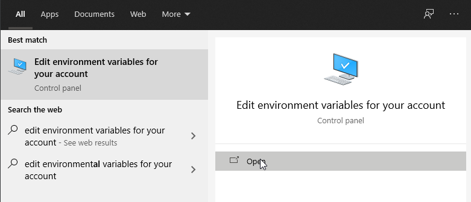

# pastry

command line tool to paste files to https://paste.myst.rs/

## download

you can get the binaries from the [release page](https://github.com/CodeMyst/pastry/releases) or build it from source

there is an arch package in the aur: [pastry-aur](https://aur.archlinux.org/packages/pastry/)

to build from source you will need dmd and dub, then just run `dub build`

### setting up on windows

after downloading the cli tool for windows,
1. 
    * if there is a zip file, extract all the contents
    * if there is a single executable, skip this step
2. to run pastry, open a terminal and run it in the same directory pastry is stored in

this works completely fine and there's nothing wrong with it, however, for ease, you are recommended to add pastry to your `PATH` argument.

you can do so by opening "edit environment variables" from contorl panel or the start menu:



under "system variables", select the `Path` row and hit edit. finally, create a new variable and enter the path where you prefer to store pastry-cli. It is recommended to store it in some location like `C:/Program Files/pastry-cli`. if you have it there, enter `%PROGRAMFILES%/pastry-cli/`. open up a new session of a terminal to verify that it works.

there is another alternate way which is not recommended, but possible:

you can store pastry in `C:/Windows/` if you prefer not to add it to your `PATH` variable. Beware that this may be dangerous.

## usage

create paste from files
```
pastry file1.txt file2.txt someDir/
```

set title
```
pastry file1.txt -t "paste title"
```

set language of all files
```
pastry file1 -l markdown
```

set expires in
```
pastry file1 -e oneHour
```

setting the default expires in time, this value will be used when you dont specify the `--expires|-e` option
```
pastry --set-default-expires oneDay
```

setting the language to be used for files without an extension, default is plaintext
```
pastry --set-no-extension markdown
```

set the token, you can get your token on your pastemyst profile settings page. once you set the token you can create private pastes, and all pastes you make will show on your profile
```
pastry --set-token <YOUR_TOKEN>

# create private paste
pastry file1.txt -p
```
